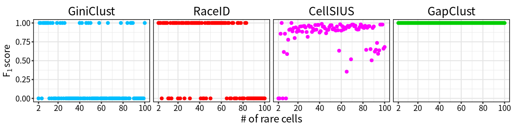
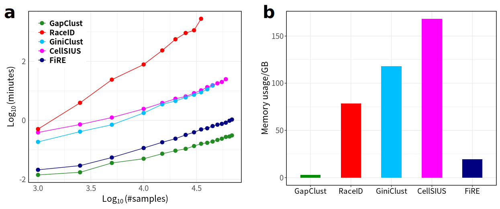

# GapClust
## Detecting rare cells from expression profiles by single cell RNA-seq.

## Introduction
GapClust takes advantage of the gap between minor cluster and neighbouring abundant cluster to let rare cells within minor cluster stand out through delicately designed statistics. Meanwhile, GapClust does not
struggle to search for rare cell informative genes like most of the competitors, but learns the cluster size as well as rare cells using simple arithmetic calculation.

## Installation
R users  can easily install GapClust by running following code in R console. 
```
# Install devtools first if it has not been installed on your R environment. Please try "install.packages("devtools")"
devtools::install_github("fabotao/GapClust")
```
## R packages prerequisites
```
Seurat
rflann
irlba
e1071
```
## Performance evaluation
  
  
  In terms of rare cell detection, GapClust offers best performance compared with other methods, quantified by F<sub>1</sub> score.
  
  

As to compuation time and memory utilization, GapClust also displays unrivaled speed and memory efficiency, in comparison with other methods.

## Publications

## Copyright
This software package is distributed under MIT license.

This work is free to use for academic and research purposes. Please contact maintainer for commercial use of this work.
